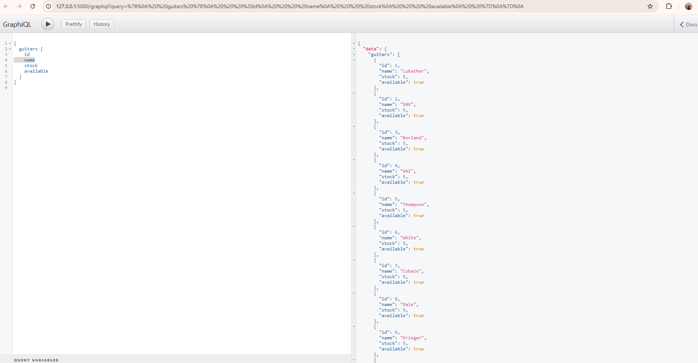

# 🛍️ Flask + GraphQL – Inventario de Tienda Online

Este proyecto implementa un backend en Flask usando GraphQL para gestionar el inventario de productos de una tienda online. Se conecta con un frontend hecho en Vue que muestra productos disponibles según el stock.

## 🚀 Requisitos

- Python 3.9 (la última versión 3.13 no es compatible con algunas librerías)
- pip

## 📦 Instalación

1. Clona este repositorio o copia los archivos del proyecto.
2. Instala las dependencias:

pip install -r requirements.txt

## ▶️ Ejecución

Para iniciar el servidor, ejecuta:

python app.py

Esto levantará el servidor en:  
👉 `http://127.0.0.1:5000/graphql`

Se debería de visualizar de ésta manera

## 📌 Especificación del Esquema

### 📍 Consulta (Query)

Obtiene todos los productos:

query {
  guitars {
    id
    nombre
    precio
    stock
    disponible
  }
}

### 🔧 Mutación (Mutation)

Modifica el stock de un producto:

mutation {
  updateStock(productId: 1, amount: -2) {
    product {
      id
      nombre
      stock
      disponible
    }
  }
}

📌 **Nota**:
- Si el stock llega a `0`, el producto se marcará como **no disponible** (`disponible: false`).
- Si el stock pasa de `0` a un valor mayor, se marcará como **disponible** (`disponible: true`).

## 🧪 Probar la API

Puedes probar directamente desde la interfaz GraphiQL que se abre en:  
`http://localhost:5000/graphql`

## 📁 Estructura del proyecto

flask_graphql_inventory/
├── app.py               # Servidor Flask con GraphQL
├── models.py            # Base de datos en memoria (lista de productos)
├── schema.py            # Esquema GraphQL (queries y mutaciones)
├── requirements.txt     # Dependencias del proyecto
└── README.md            # Instrucciones

## ✅ Estado actual

- [x] Consulta de productos
- [x] Modificación de stock con lógica de disponibilidad
- [x] API funcionando con GraphQL y Flask

